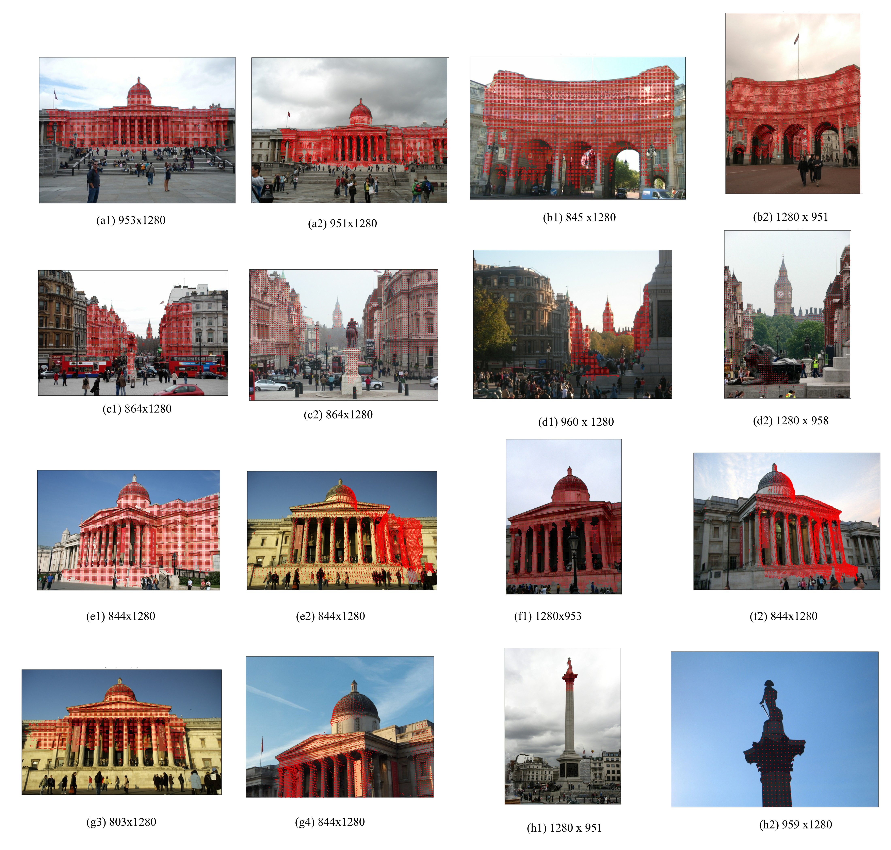

# MSD-Datasets

The paper has been accepted, and this dataset will be released once it has been finalized.

## TODO

- [x] Add Introduction
- [ ] Add Dataset use method
    - [ ] Add Python single-thread version
    - [ ] Add Python multi-thread version
    - [ ] Add C++ single-thread version
    - [ ] Add C++ multi-thread version
- [ ] Add the generated Datastes
- [x] Add Citation
- [ ] (coming soon) Add MSM CODE

## Introduction

Due to the lack of scale-related analysis in the existing datasets in the field of feature matching, this has to some extent affected the research or evaluation of feature matching algorithms for scale differences. For this purpose, we have proposed the **Scale Difference Index (SDI)** to describe scale differences, which can be derived respectively from the **Angle Difference Index (ADI)** and the **pixel Difference Index (PDI)**. Then, we constructed a **Multi-Scale Dataset (MSD)** based on SDI.

The MSD comprises two components. 

1. The first is a scale-difference dataset based on the existing Megadepth (Li and Snavely Citation2018) dataset.  It offers the advantage of a large amount of data and images that are very close to nature. 
2. The second was a self-constructed scale-difference dataset based on remote sensing imagery from UAVs. It offers the advantage of very clear images, which are suitable for research in remote sensing from UAVs and other areas.

The main function of this repository is to provide the MSD-Dataset based on MegaDepth.

For more details, please check [**Paper section 5**](https://www.tandfonline.com/doi/full/10.1080/17538947.2025.2543562#d1e4493).



Examples of Multi-Scale Dataset. The content of the subheading is the image resolution. (a, b) low ADI, low PDI; (c, d) low ADI, high PDI; (e, f) high ADI, low PDI; (h, g) high ADI, high PDI.

## Get the Dataset

### Download Megadepth

There are many versions of this dataset. The version adopted in this study is the one used in DISK.

For the download, you can refer to the official guidelines of [DISK](https://github.com/cvlab-epfl/disk), and please pay close attention to the file [download_dataset](https://github.com/cvlab-epfl/disk/blob/master/download_dataset)。

### Method 1: Run The Code

### Method 2: The Generated Dataset Based On Megadepth

If it's not convenient for you to generate the dataset yourself through code, we also provide pre-calculated datasets, which can help you use them more quickly.

- Baidu Yun: (Coming Soon)
- Google Drive: (Coming Soon)
- GitHub Release: (Coming Soon)

### Analysis of the dataset file format

## FAQ

## Citation

Should you find this dataset beneficial to your work, we kindly request that you cite it using the provided BibTeX entry.

```bibtex
@article{Ge25082025,
    author = {Qifeng Ge and Xiaoping Du and Chen Xu and Jianhao Xu and Zhenzhen Yan and Xiangtao Fan},
    title = {MSM: a scaling-based feature matching algorithm for images with large-scale differences},
    journal = {International Journal of Digital Earth},
    volume = {18},
    number = {1},
    pages = {2543562},
    year = {2025},
    publisher = {Taylor \& Francis},
    doi = {10.1080/17538947.2025.2543562},
    URL = {https://doi.org/10.1080/17538947.2025.2543562},
    eprint = {https://doi.org/10.1080/17538947.2025.2543562}
}
```

## Acknowledgements
